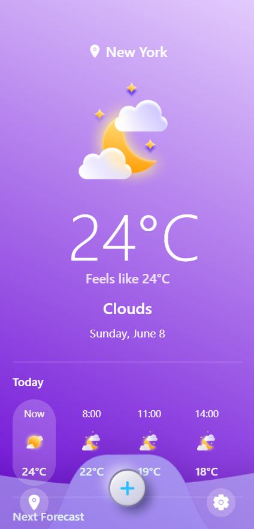

# Weather App

A modern, intuitive weather application built with React Native and Expo that provides real-time weather information with a beautiful UI.

## Source Code Repository

The complete source code for this project is available at:
- GitHub: [https://github.com/Timori52/ReactNative-WeatherApp.git]
(https://github.com/Timori52/ReactNative-WeatherApp.git)

#DEMO

    

## Technologies Used

- **React Native**: Framework for building cross-platform mobile applications
- **Expo**: Development platform and toolchain for React Native
- **TypeScript**: Strongly typed programming language that builds on JavaScript
- **OpenWeather API**: RESTful API for weather data, forecasts, and geocoding
- **Expo Router**: File-based routing system for Expo apps
- **AsyncStorage**: Local data persistence solution
- **Expo Location**: Geolocation services for accessing device location
- **Expo Vector Icons**: Library of customizable icons
- **Linear Gradient**: Component for creating gradient backgrounds
- **React Native Reanimated**: Library for fluid animations

## Design Rationale

The Weather App was designed with a focus on simplicity, visual appeal, and usability. Key design decisions include:

1. **Clean, Minimalist Interface**: The app employs a modern UI with ample white space and a clear information hierarchy to prevent cognitive overload.

2. **Contextual Weather Information**: Information is presented in logical sections (current weather, hourly forecast, daily forecast, and weather metrics) to provide a comprehensive view of weather conditions.

3. **Intuitive Interaction Model**: The app uses familiar patterns like pull-to-refresh, modal dialogs for city search, and bottom navigation for core functions.

4. **Visual Feedback**: Weather conditions are represented through both text and custom icons, with additional visual cues like the air quality indicator providing immediate understanding.

5. **Responsive Design**: The interface adapts to different screen sizes while maintaining readability and touch target sizes.

6. **Gradient Backgrounds**: A subtle blue gradient provides visual interest while serving as a neutral backdrop for weather information.

7. **Independent Weather Metric Cards**: Each weather metric (humidity, wind speed, etc.) is displayed in its own card for clear separation and improved scanability.

## How to Run the App Locally

### Prerequisites

- Node.js (v14 or later)
- npm or yarn
- Expo CLI (`npm install -g expo-cli`)
- For mobile testing:
  - Android Studio (for Android emulation)
  - Xcode (for iOS simulation, Mac only)
  - Physical device with Expo Go app

### Installation Steps

1. Clone the repository:
   ```bash
   git clone https://github.com/Timori52/
   ReactNative-WeatherApp.git
   ```

2. Install dependencies:
   ```bash
   npm install
   # or
   yarn install
   ```

3. Start the development server:
   ```bash
   npx expo start
   ```

4. Run on a device or emulator:
   - Press `a` in the terminal to run on an Android emulator
   - Press `i` to run on an iOS simulator (Mac only)
   - Scan the QR code with the Expo Go app on your physical device

## Usability Heuristics Focus

This app was developed with particular attention to the following usability heuristics:

### 1. Visibility of System Status
- **Implementation**: Loading indicators appear during data fetching, the current city is always displayed, and temperature unit changes are immediately reflected.
- **Benefit**: Users always know what's happening and where they are in the system.

### 2. Match Between System and the Real World
- **Implementation**: Custom weather icons match real-world weather conditions, temperature units (°C/°F) are familiar, and weather metrics use standard terminology and units (e.g., humidity in %, pressure in hPa).
- **Benefit**: The system speaks the users' language with familiar concepts and conventions.

### 3. User Control and Freedom
- **Implementation**: Easy city switching via search, ability to use current location with a single tap, and unit preference that persists between sessions.
- **Benefit**: Users can easily navigate, make choices, and undo mistakes.

### 4. Aesthetic and Minimalist Design
- **Implementation**: Clean interface with focused information presentation, weather metrics in discrete cards, and subtle gradients that don't overwhelm.
- **Benefit**: Interface focuses on essential information without distractions.

### 5. Flexibility and Efficiency of Use
- **Implementation**: Quick access to current location weather, city search with popular suggestions, and persistent user preferences.
- **Benefit**: Both novice and experienced users can efficiently use the app according to their needs.

### 6. Help Users Recognize, Diagnose, and Recover from Errors
- **Implementation**: Clear error messages for API failures, graceful fallbacks when features are unavailable, and automatic retries.
- **Benefit**: Users understand when something goes wrong and can take appropriate action.

## Future Enhancements

- Weather alerts and notifications
- More detailed weather information (precipitatio,UV Index, Dew Point Raining Probablities etc.)
- Historical weather data
- Weather maps
- Multiple saved locations
- Dark/light theme support
- Localization for multiple languages
